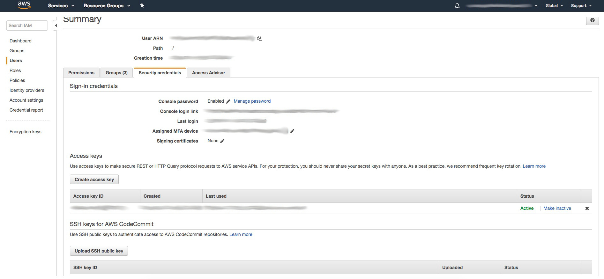
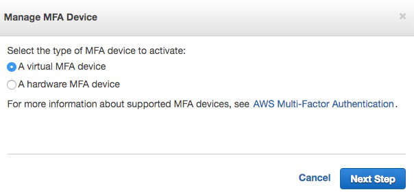
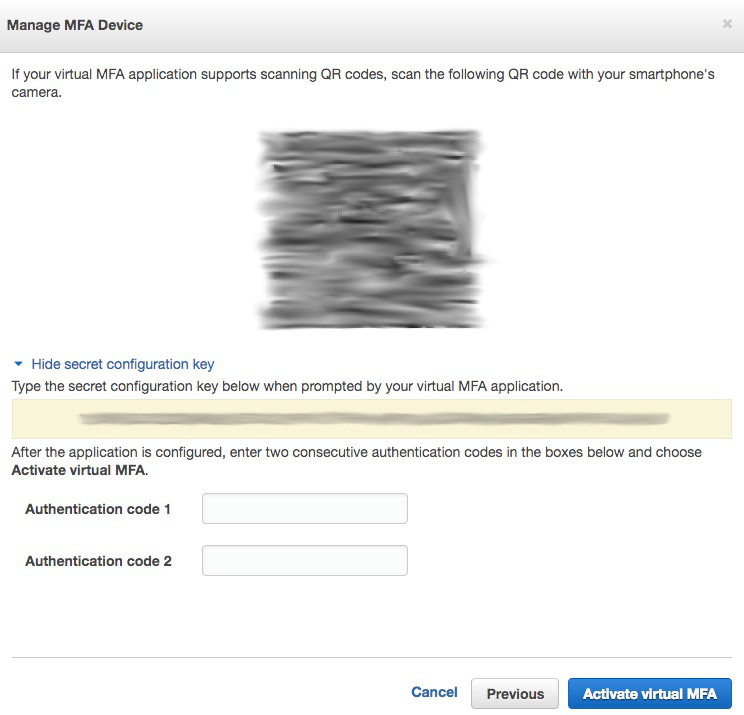
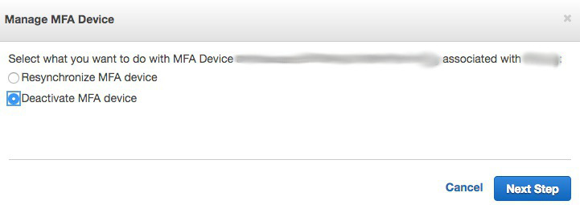

# How to configure auto mfa token generation
1. Go to AWS console, `IAM` service, `Users`, locate your user and select it then select `Security credentials`

2. Assign new MFA device by clinking `Assigned MFA device` and `A virtual MFA device`

3. On `configuration information screen` configure your favourite token generation tool with the provided QR code graphic and click on `Show secret key for manual configuration`

4. Copy the secret configuration key to `~/.assume-role.properties`, use `mfa.secret` property
5. Use your token generation tool to finish token validation(`Authentication Code 1` and `Authentication Code 2`) or execute `assume-role --generate-token`
6. Done

Note: If you are already using MFA device you have to deactivate it first

